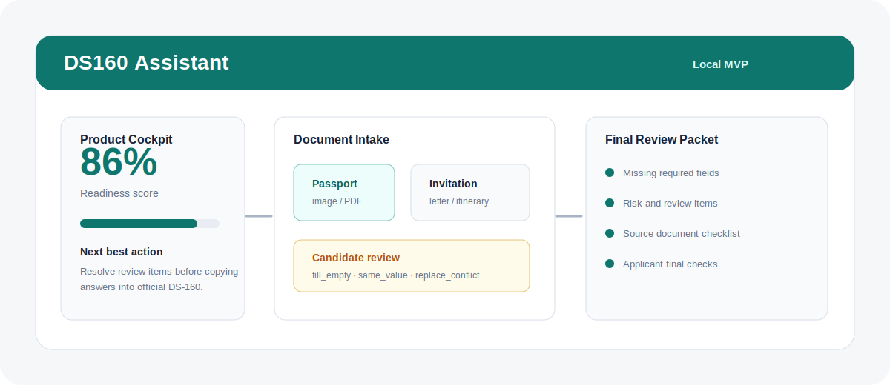
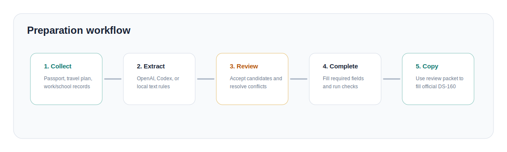
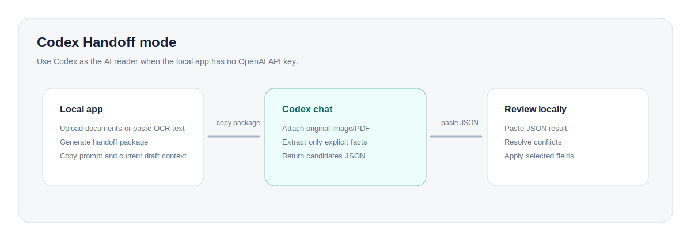

# DS160 Assistant

<p align="center">
  
</p>

<p align="center">
  <strong>Local-first, human-in-the-loop DS-160 drafting assistant.</strong><br />
  Collect documents, extract candidate answers with AI/Codex/local rules, review conflicts, and prepare a final copy packet before manually completing the official form.
</p>

<p align="center">
  <a href="#中文说明">中文</a> ·
  <a href="#english">English</a> ·
  <a href="#quick-start">Quick Start</a> ·
  <a href="#codex-handoff">Codex Handoff</a>
</p>

> **Important:** This is not an official U.S. government tool. It does not submit DS-160, sign for the applicant, bypass captchas, or make legal decisions. The applicant must personally review the official DS-160 before electronic signature and submission.

## Product Preview

<p align="center">
  
</p>

<p align="center">
  
</p>

## 中文说明

DS160 Assistant 是一个本地运行的 DS-160 草稿准备工具。它把“收集资料、识别信息、人工复核、生成最终准备包”串成一个可控流程，帮助申请人在进入官方 DS-160 网站前先整理好答案。

### 适合谁

- 需要准备美国非移民签证 DS-160 的个人或顾问
- 想把护照、邀请信、I-20/DS-2019、工作证明、旧签证记录等材料整理成结构化草稿的人
- 没有 OpenAI API key，但愿意用当前 Codex 对话协助读图/读 PDF 的用户
- 重视隐私、本地运行、人工确认的人

### 核心能力

- **Product Cockpit:** 显示 readiness score、当前阶段和下一步最佳动作
- **Document Intake:** 支持图片、PDF、TXT、JSON 上传，也支持粘贴 OCR 或复制文本
- **Folder Mode:** 把材料放进本地 `materials/` 文件夹，不用逐个从浏览器上传
- **三种提取方式:** OpenAI API、Codex Handoff、本地文本规则
- **候选字段审阅:** 标记 `fill_empty`、`same_value`、`replace_conflict`，冲突项默认不勾选
- **Dossier JSON:** 生成标准化 case ID、分区状态、字段映射、证据目录和安全边界
- **Final Review Packet:** 汇总缺失必填项、风险复核项、材料清单和最终检查
- **隐私保护:** 本地运行；审计日志只记录计数和事件，不记录完整个人答案
- **加密导出:** 浏览器端 Web Crypto AES-GCM + PBKDF2 加密 dossier

### 工作流

1. **收集材料:** 上传护照、邀请信、学校/雇主文件、旧签证记录，或粘贴 OCR 文本。
2. **提取候选字段:** 使用 OpenAI API、Codex Handoff 或本地文本规则。
3. **人工确认:** 逐项查看候选字段，确认冲突后再写入草稿。
4. **完成草稿:** 补齐必填项，查看分区 readiness 和问题清单。
5. **最终复核:** 导出 Final Review Packet，再手动进入官方 DS-160 网站填写。

### Codex Handoff

没有 OpenAI API key 时，推荐使用 Codex 模式：

1. 在本地页面右侧 **Document Intake** 选择图片/PDF/TXT/JSON，或粘贴文字。
2. 在 **Codex Mode** 点击 `1. Generate Codex package`。
3. 点击 `2. Copy for Codex`。
4. 在 Codex 对话里上传原始图片/PDF，并粘贴分析包。
5. 让 Codex 只返回 `ds160-codex-candidates-v1` JSON。
6. 把 JSON 粘贴回本地页面，点击 `Parse Codex result`。
7. 勾选候选字段，确认后应用到表单。

Codex 返回格式示例：

```json
{
  "format": "ds160-codex-candidates-v1",
  "candidates": [
    {
      "fieldId": "passport_number",
      "value": "E12345678",
      "confidence": 0.9,
      "source": "passport image",
      "requiresReview": true
    }
  ],
  "notes": ["Applicant should verify against passport bio page."]
}
```

### 快速开始

```powershell
python -m venv .venv
.\.venv\Scripts\python.exe -m pip install -r requirements.txt
.\.venv\Scripts\python.exe -m ds160_agent.web --port 8780
```

打开：

```text
http://127.0.0.1:8780
```

本地文件夹模式：

```text
materials/
  passport.jpg
  invitation.pdf
  i20.pdf
  employment-letter.txt
```

把材料放进项目根目录的 `materials/`，打开页面后点击 `刷新 materials 文件夹`，选择文件，再点 `载入选中文件`。实际材料会被 `.gitignore` 忽略，不会推送到 GitHub；仓库只保留空目录占位文件。

启用图片/PDF AI 分析：

```powershell
$env:OPENAI_API_KEY="your key"
$env:DS160_AI_MODEL="gpt-4o-mini"
.\.venv\Scripts\python.exe -m ds160_agent.web --port 8780
```

## English

DS160 Assistant is a local-first preparation tool for DS-160 drafts. It turns source documents into reviewable candidate answers, helps the applicant resolve conflicts, and produces a final copy packet before the applicant manually completes the official DS-160 form.

### Who It Is For

- Individuals preparing a U.S. nonimmigrant visa DS-160
- Advisors who need a structured, auditable intake workflow
- Users who want document extraction without giving the local app an API key
- Privacy-conscious users who want local storage and human confirmation

### Key Capabilities

- **Product Cockpit:** Readiness score, current stage, and next best action
- **Document Intake:** Upload images, PDFs, TXT, JSON, or paste OCR/copied text
- **Folder Mode:** Drop files into local `materials/` and load them without browser upload
- **Three extraction paths:** OpenAI API, Codex Handoff, or local text heuristics
- **Candidate review:** Labels fill-empty, same-value, and replace-conflict candidates
- **Dossier JSON:** Case ID, section readiness, field map, evidence catalog, and safety boundaries
- **Final Review Packet:** Missing fields, risk items, source checklist, and final checks
- **Privacy-conscious audit log:** Counts and events only, no full applicant answers
- **Encrypted export:** Browser-side Web Crypto AES-GCM + PBKDF2

### Quick Start

```powershell
python -m venv .venv
.\.venv\Scripts\python.exe -m pip install -r requirements.txt
.\.venv\Scripts\python.exe -m ds160_agent.web --port 8780
```

Open:

```text
http://127.0.0.1:8780
```

Local folder mode:

```text
materials/
  passport.jpg
  invitation.pdf
  i20.pdf
  employment-letter.txt
```

Put files under the project-root `materials/` folder, click `Refresh materials folder`, select a file, then click `Load selected file`. Real applicant materials are ignored by `.gitignore`; only the placeholder file is tracked.

Enable AI analysis for images/PDFs:

```powershell
$env:OPENAI_API_KEY="your key"
$env:DS160_AI_MODEL="gpt-4o-mini"
.\.venv\Scripts\python.exe -m ds160_agent.web --port 8780
```

### Codex Handoff

When you do not have an OpenAI API key:

1. In **Document Intake**, choose an image/PDF/TXT/JSON or paste OCR text.
2. In **Codex Mode**, click `1. Generate Codex package`.
3. Click `2. Copy for Codex`.
4. In the Codex chat, upload the original image/PDF and paste the package.
5. Ask Codex to return only `ds160-codex-candidates-v1` JSON.
6. Paste that JSON back into the Codex result box.
7. Parse, review, and apply selected candidates locally.

## Architecture

```text
Browser UI
  ├─ Manual DS-160 draft form
  ├─ Document intake and candidate review
  ├─ Codex handoff package generator
  └─ Encrypted local export/import

Local Python server
  ├─ Field schema and validation
  ├─ Dossier and review packet generation
  ├─ Local text extraction
  ├─ Optional OpenAI Responses API bridge
  └─ Privacy-conscious audit log
```

## Project Layout

```text
ds160_agent/
  core.py              Field schema, validation, draft, product guidance
  dossier.py           Dossier contract, field map, section readiness
  document_intake.py   Document upload, AI analysis, Codex handoff, local extraction
  audit.py             Privacy-conscious local audit log
  web.py               Local HTTP server and API
  static/              Browser UI

materials/             Local-only applicant source files, ignored by Git

sample_data/
  china_b1b2_sample.json

tests/
  test_ds160_agent.py
  test_document_intake.py
```

## Development

Run tests:

```powershell
.\.venv\Scripts\python.exe -m pytest tests\test_ds160_agent.py tests\test_document_intake.py
```

Run compile checks:

```powershell
.\.venv\Scripts\python.exe -m compileall ds160_agent
```

## Safety Boundaries

- The app prepares a draft only.
- Applicant must personally review all official DS-160 pages.
- Applicant must personally sign and submit.
- Security/background answers should not be inferred from silence.
- Exported files contain sensitive personal information and should be stored carefully.
